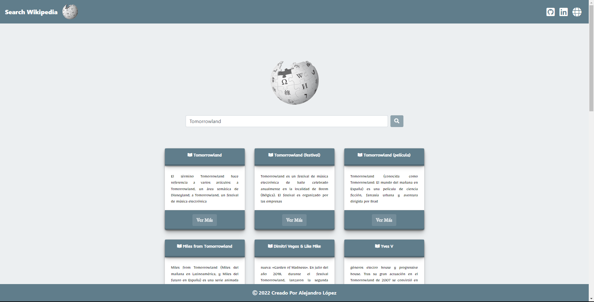

# <h1 align="center" style="color: #80cbc4;"> MediaWiki API 👨🏻‍💻 </h1> 
  

The `MediaWiki` Action API is a web service that allows access to some wiki features like authentication, page operations, and search. It can provide meta information about the wiki and the logged-in user.        

  

## 
 Requirements 

- [HTML5](https://developer.mozilla.org/es/docs/Web/HTML) 
- [CSS3](https://developer.mozilla.org/es/docs/Web/CSS)
- [JavaScript](https://developer.mozilla.org/es/docs/Web/JavaScript)

## 
 References 

- [MediaWiki](https://www.mediawiki.org/wiki/API:Main_page)
- [MediaWiki Help](https://es.wikipedia.org/w/api.php) 

  

## 
 Screenshot Project 💻 

🔶 [Project Website](https://alejandro-lopez.futuretecware.com/MediaWiki-API/index.html)

